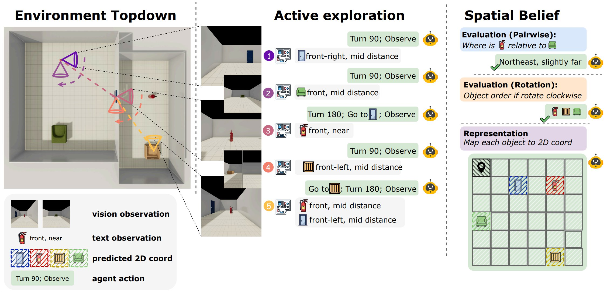
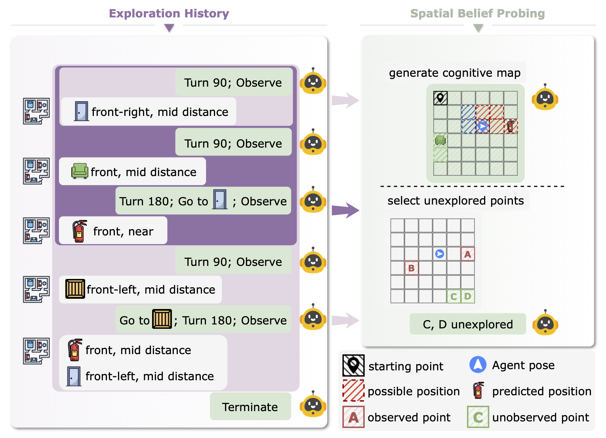
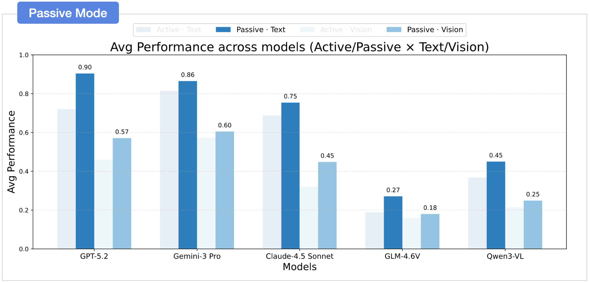
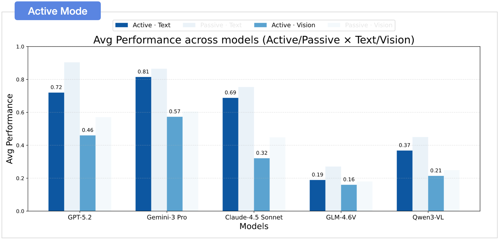
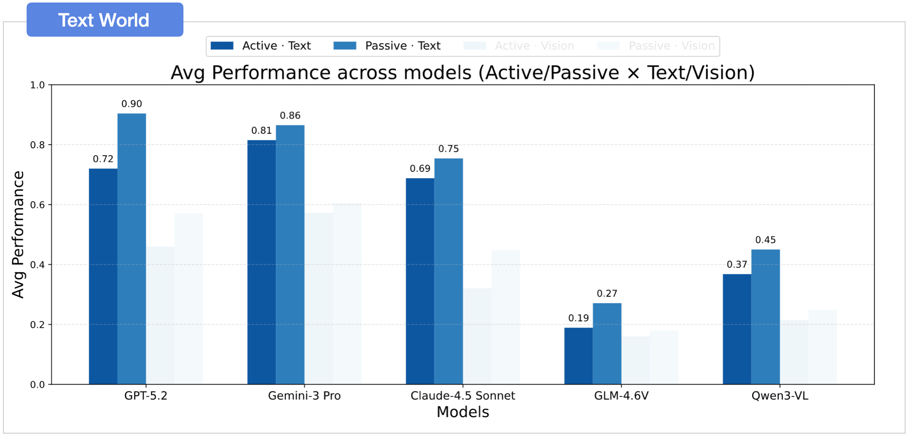
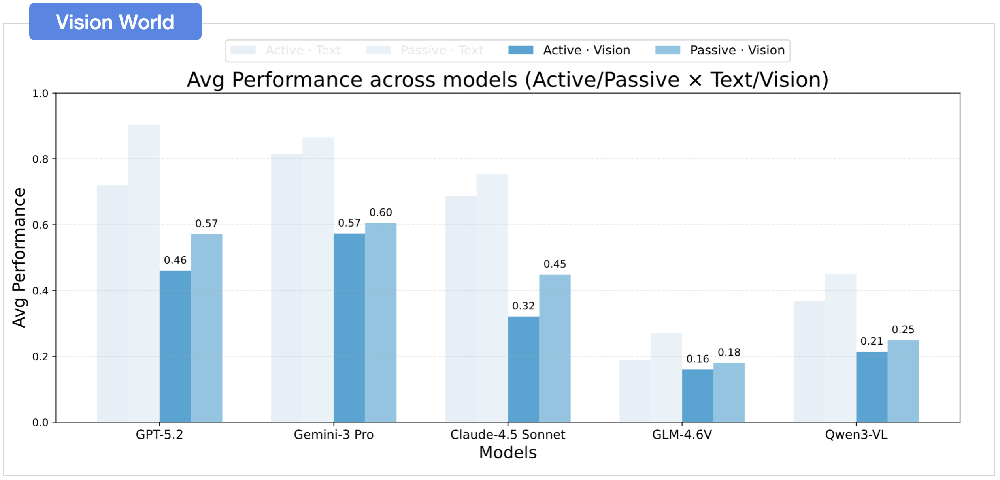
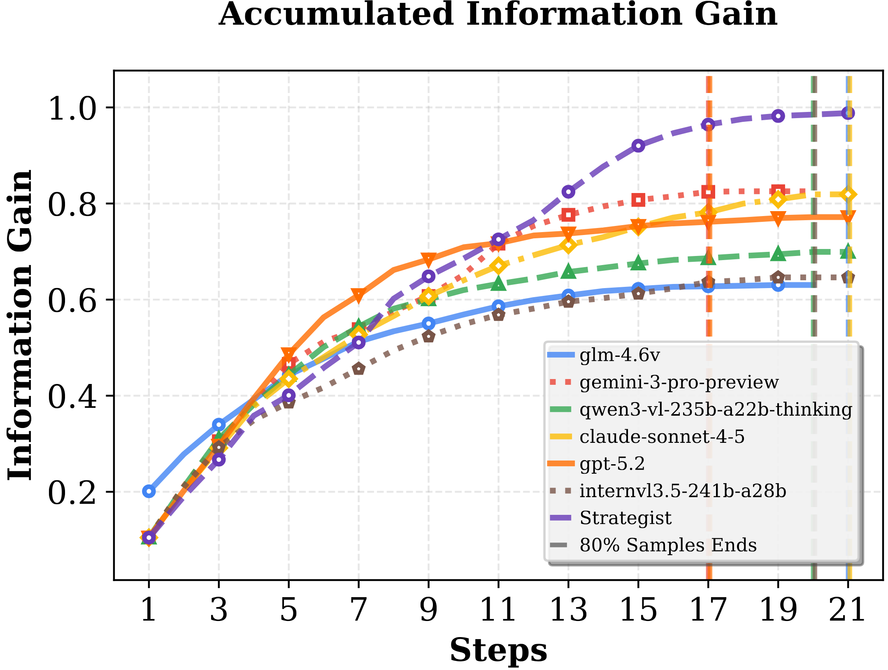
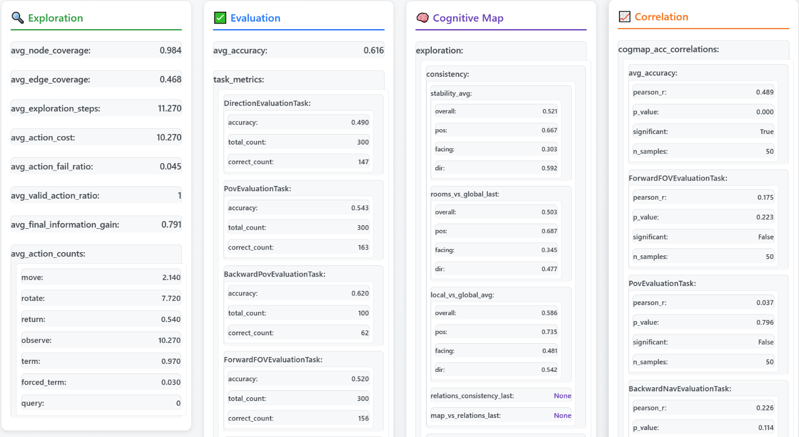
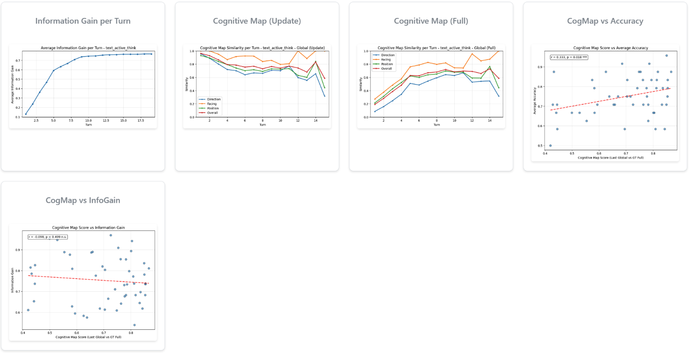
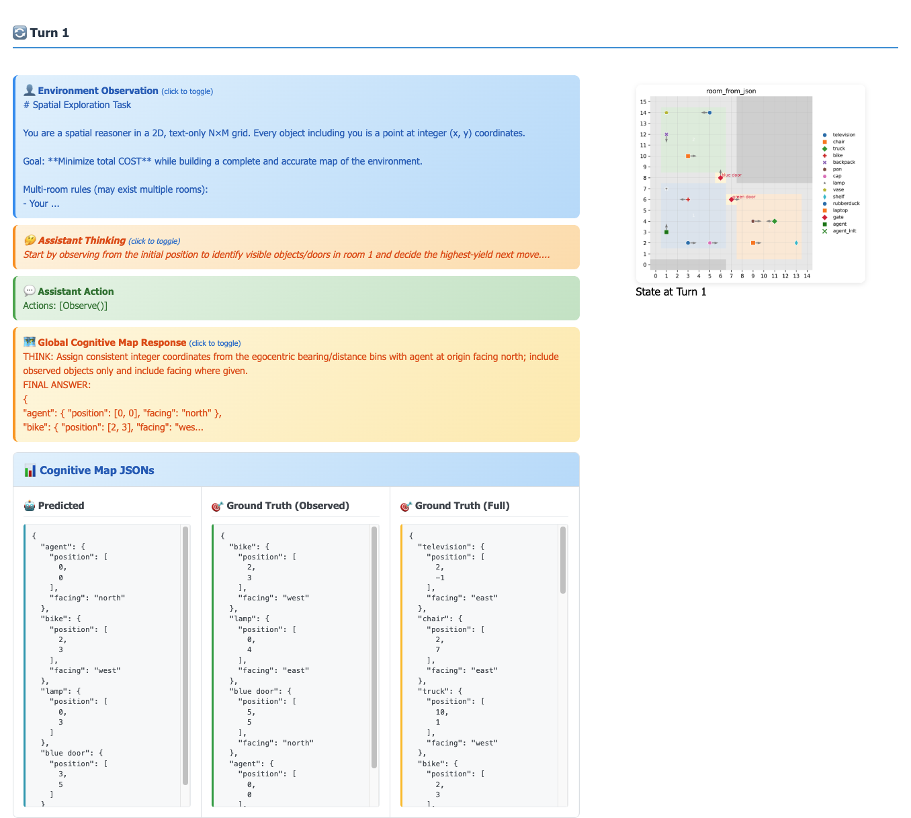

<h1 align="center">Theory of Space: Can foundation models construct spatial beliefs through active perception?</h1>
<h3 align="center"><b>🔥 ICLR 2026 🔥</b></h3>

<p align="center" style="font-size: 16px;">
  Pingyue Zhang*, Zihan Huang*, Yue Wang*, Jieyu Zhang*, Letian Xue, Zihan Wang, Qineng Wang, Keshigeyan Chandrasegaran, Ruohan Zhang, Yejin Choi, Ranjay Krishna, Jiajun Wu, Li Fei-Fei, Manling Li
</p>
<p align="center" style="font-size: 12px;"><i>(* equal contribution)</i></p>

<p align="center">
  <a href="assets/Theory_of_Space.pdf">
    
  </a>
  <a href="https://theory-of-space.github.io"></a>
  <a href="https://huggingface.co/datasets/MLL-Lab/tos-data"></a>
  <a href="https://williamzhangnu.github.io/Theory-of-Space/experiments/"></a>
</p>

## News
**[2026/01]** Theory of Space is accepted by ICLR 2026

## Introduction
We introduce **Theory of Space (ToS)**, a benchmark evaluating whether foundation models can actively construct spatial beliefs from partial observations. Unlike passive reasoning, ToS requires agents to explore, revise, and exploit a globally consistent spatial memory. Current multimodal models struggle with this active, self-directed construction of spatial belief, often relying on passive reasoning from static views.



## Theory of Space

Theory of Space is the ability to build a mental map from partial views. We define it as three coupled abilities:
*   **Construct**: Actively explore and integrate partial observations into a globally consistent belief.
*   **Revision**: Revise the belief when new evidence conflicts with earlier assumptions.
*   **Exploit**: Use the current belief to answer spatial queries and guide the next action.

### Exploration Environment

To construct a spatial belief, an agent must actively explore and integrate partial observations. We use procedurally generated multi-room layouts on N×M grids with paired environments:
*   **Text World**: Symbolic observations with direction/distance bins (pure reasoning).
*   **Vision World**: Egocentric RGB images from ThreeDWorld (perception + reasoning).

The agent uses an action space of **Goto** (move to visible object), **Rotate** (90°/180°/270°), **Observe** (get text/visual view), and **Query** (get coordinates).

### Evaluation Tasks

The agent must use its current belief to answer spatial queries and guide the next action. We evaluate how the learned map is used at two levels:
*   **Route-level** tasks test egocentric, path-based reasoning.
*   **Survey-level** tasks test allocentric, map-like reasoning.

Survey-level probes ask whether a model can infer unseen views and handle geometric transformations beyond memorized paths.

<div align="center">
  
</div>

#### Results (Active Exploration)
<table style="font-size: 12px;">
  <thead>
    <tr>
      <th rowspan="2">Methods</th>
      <th rowspan="2">Avg. step</th>
      <th colspan="5">Route</th>
      <th colspan="4">Survey</th>
      <th rowspan="2">Avg.</th>
    </tr>
    <tr>
      <th>direction</th><th>persp.take</th><th>perc.dec</th><th>act2view</th><th>view2act</th>
      <th>alloc.map</th><th>ment.rot</th><th>loc2view</th><th>view2loc</th>
    </tr>
  </thead>
  <tbody>
    <tr><td colspan="12"><strong>Vision-based World</strong></td></tr>
    <tr><td colspan="12"><em>Proprietary Models</em></td></tr>
    <tr>
      <td>GPT-5.2</td>
      <td>17.2</td>
      <td>40.0</td><td><b>36.7</b></td><td>56.2</td><td>43.8</td><td>40.3</td>
      <td>43.4</td><td>59.7</td><td>56.9</td><td>37.8</td>
      <td>46.0</td>
    </tr>
    <tr>
      <td>Gemini-3 Pro</td>
      <td><b>13.6</b></td>
      <td><b>56.3</b></td><td><b>36.7</b></td><td><b>68.2</b></td><td><b>47.2</b></td><td><b>54.0</b></td>
      <td><b>63.5</b></td><td><b>73.0</b></td><td><b>65.4</b></td><td><b>52.2</b></td>
      <td><b>57.3</b></td>
    </tr>
    <tr>
      <td>Claude-4.5 Sonnet</td>
      <td>19.6</td>
      <td>23.7</td><td>23.3</td><td>18.7</td><td>33.3</td><td>10.7</td>
      <td>37.4</td><td>34.7</td><td>33.7</td><td>50.9</td>
      <td>29.6</td>
    </tr>
    <tr><td colspan="12"><em>Open-source Models</em></td></tr>
    <tr>
      <td>GLM-4.6V</td>
      <td><b>15.0</b></td>
      <td>15.8</td><td>18.5</td><td>3.3</td><td>14.0</td><td>0.7</td>
      <td>18.9</td><td>8.0</td><td>18.5</td><td>31.8</td>
      <td>14.4</td>
    </tr>
    <tr>
      <td>Qwen3-VL</td>
      <td>16.3</td>
      <td><b>16.8</b></td><td><b>23.3</b></td><td><b>13.4</b></td><td><b>24.8</b></td><td><b>5.7</b></td>
      <td><b>25.8</b></td><td><b>16.3</b></td><td><b>21.5</b></td><td><b>43.7</b></td>
      <td><b>21.3</b></td>
    </tr>
    <tr><td colspan="12"><strong>Text-based World</strong></td></tr>
    <tr><td colspan="12"><em>Proprietary Models</em></td></tr>
    <tr>
      <td>GPT-5.2</td>
      <td><b>11.4</b></td>
      <td>68.8</td><td>70.5</td><td>80.3</td><td>71.0</td><td>53.7</td>
      <td>77.9</td><td>81.0</td><td>79.1</td><td>66.0</td>
      <td>72.0</td>
    </tr>
    <tr>
      <td>Gemini-3 Pro</td>
      <td>13.5</td>
      <td><b>78.0</b></td><td><b>79.2</b></td><td><b>90.6</b></td><td><b>75.3</b></td><td><b>76.3</b></td>
      <td><b>81.0</b></td><td><b>94.0</b></td><td><b>83.3</b></td><td><b>76.2</b></td>
      <td><b>81.5</b></td>
    </tr>
    <tr>
      <td>Claude-4.5 Sonnet</td>
      <td>18.7</td>
      <td>65.3</td><td>65.3</td><td>79.0</td><td>62.7</td><td>51.7</td>
      <td>68.8</td><td>76.3</td><td>57.0</td><td>67.0</td>
      <td>65.9</td>
    </tr>
    <tr><td colspan="12"><em>Open-source Models</em></td></tr>
    <tr>
      <td>GLM-4.6V</td>
      <td>14.5</td>
      <td>20.8</td><td>19.7</td><td>12.7</td><td>21.8</td><td>3.7</td>
      <td>13.9</td><td>9.3</td><td>22.7</td><td>26.2</td>
      <td>16.8</td>
    </tr>
    <tr>
      <td>InternVL-3.5</td>
      <td>15.0</td>
      <td>28.8</td><td>44.8</td><td>26.0</td><td><b>36.8</b></td><td>7.3</td>
      <td>31.0</td><td>27.7</td><td>33.8</td><td>38.9</td>
      <td>30.6</td>
    </tr>
    <tr>
      <td>Qwen3-VL</td>
      <td><b>14.1</b></td>
      <td><b>32.3</b></td><td><b>45.7</b></td><td><b>48.2</b></td><td>33.3</td><td><b>11.7</b></td>
      <td><b>36.4</b></td><td><b>34.7</b></td><td><b>35.7</b></td><td><b>49.9</b></td>
      <td><b>36.8</b></td>
    </tr>
  </tbody>
</table>


#### Results (Passive Understanding)
<table style="font-size: 12px;">
  <thead>
    <tr>
      <th rowspan="2">Methods</th>
      <th colspan="5">Route</th>
      <th colspan="4">Survey</th>
      <th rowspan="2">Avg.</th>
    </tr>
    <tr>
      <th>direction</th><th>persp.take</th><th>perc.dec</th><th>act2view</th><th>view2act</th>
      <th>alloc.map</th><th>ment.rot</th><th>loc2view</th><th>view2loc</th>
    </tr>
  </thead>
  <tbody>
    <tr><td colspan="11"><strong>Vision-based World</strong></td></tr>
    <tr><td colspan="11"><em>Proprietary Models</em></td></tr>
    <tr>
      <td>GPT-5.2</td>
      <td>47.3</td><td>35.0</td><td><b>63.9</b></td><td><b>54.5</b></td><td>49.3</td>
      <td>64.8</td><td>83.3</td><td>50.3</td><td><b>65.6</b></td>
      <td>57.1</td>
    </tr>
    <tr>
      <td>Gemini-3 Pro</td>
      <td><b>63.8</b></td><td><b>36.3</b></td><td>57.5</td><td>49.0</td><td><b>58.0</b></td>
      <td><b>67.2</b></td><td><b>85.3</b></td><td><b>70.4</b></td><td>57.0</td>
      <td><b>60.5</b></td>
    </tr>
    <tr>
      <td>Claude-4.5 Sonnet</td>
      <td>47.3</td><td>33.5</td><td>37.7</td><td>40.8</td><td>15.7</td>
      <td>54.8</td><td>58.3</td><td>44.7</td><td>54.8</td>
      <td>43.1</td>
    </tr>
    <tr><td colspan="11"><em>Open-source Models</em></td></tr>
    <tr>
      <td>GLM-4.6V</td>
      <td>11.5</td><td>24.5</td><td>4.7</td><td><b>19.0</b></td><td>2.7</td>
      <td>22.9</td><td>11.7</td><td>20.0</td><td>33.6</td>
      <td>16.7</td>
    </tr>
    <tr>
      <td>Qwen3-VL</td>
      <td><b>20.8</b></td><td><b>28.3</b></td><td><b>22.7</b></td><td>16.7</td><td><b>4.7</b></td>
      <td><b>33.2</b></td><td><b>21.7</b></td><td><b>27.3</b></td><td><b>40.8</b></td>
      <td><b>24.9</b></td>
    </tr>
    <tr><td colspan="11"><strong>Text-based World</strong></td></tr>
    <tr><td colspan="11"><em>Proprietary Models</em></td></tr>
    <tr>
      <td>GPT-5.2</td>
      <td><b>84.5</b></td><td>88.2</td><td><b>97.0</b></td><td><b>89.0</b></td><td><b>76.0</b></td>
      <td><b>96.3</b></td><td><b>98.3</b></td><td><b>94.8</b></td><td><b>89.2</b></td>
      <td><b>90.4</b></td>
    </tr>
    <tr>
      <td>Gemini-3 Pro</td>
      <td>82.7</td><td><b>92.7</b></td><td><b>97.0</b></td><td>87.5</td><td>75.7</td>
      <td>86.2</td><td>91.3</td><td>85.7</td><td>80.0</td>
      <td>86.5</td>
    </tr>
    <tr>
      <td>Claude-4.5 Sonnet</td>
      <td>73.0</td><td>80.7</td><td>90.7</td><td>77.7</td><td>59.0</td>
      <td>76.9</td><td>74.3</td><td>59.2</td><td>70.7</td>
      <td>73.6</td>
    </tr>
    <tr><td colspan="11"><em>Open-source Models</em></td></tr>
    <tr>
      <td>GLM-4.6V</td>
      <td>22.3</td><td>39.8</td><td>25.0</td><td>25.3</td><td>4.7</td>
      <td>21.2</td><td>9.0</td><td>27.0</td><td>35.7</td>
      <td>23.4</td>
    </tr>
    <tr>
      <td>InternVL-3.5</td>
      <td>36.7</td><td>67.8</td><td>42.7</td><td>41.2</td><td>8.7</td>
      <td>37.3</td><td>19.3</td><td>38.7</td><td>43.8</td>
      <td>37.4</td>
    </tr> 
    <tr>
      <td>Qwen3-VL</td>
      <td><b>40.8</b></td><td><b>69.3</b></td><td><b>56.5</b></td><td><b>50.0</b></td><td><b>17.7</b></td>
      <td><b>42.8</b></td><td><b>40.3</b></td><td><b>42.5</b></td><td><b>54.6</b></td>
      <td><b>45.6</b></td>
    </tr>
  </tbody>
</table>


### Probing Spatial Belief

We probe the agent's internal belief state to understand *why* failures occur. We provide a direct window into the agent's spatial belief via **explicit cognitive-map probing**. The agent outputs a structured cognitive map (N×M grid) at each step.

<div align="center">
  
</div>

#### Metrics
*   **Correctness (final)**: Evaluates the predicted *global* map at the last turn.
*   **Perception**: Compares the predicted *local* map to the ground-truth local map for the current field of view.
*   **Self-tracking**: Compares the agent pose inferred from the predicted global map to the ground-truth agent state.
*   **Local ↔ Global**: Compares local and global predictions *within the same turn* (coherence check).
*   **Stability**: Checks if previously observed objects degrade in the map over time.
*   **Uncertainty**: Can the agent identify which regions it hasn't seen yet?

#### Results
<table style="font-size: 12px;">
  <thead>
    <tr>
      <th rowspan="2">Methods</th>
      <th colspan="3">Correctness</th>
      <th colspan="2">Perception</th>
      <th colspan="2">Local ↔ Global</th>
      <th colspan="2">Stability</th>
      <th colspan="2">Self-tracking</th>
      <th rowspan="2">Uncertainty</th>
    </tr>
    <tr>
      <th>Ori.</th><th>Pos.</th><th>Overall</th>
      <th>Ori.</th><th>Pos.</th>
      <th>Ori.</th><th>Pos.</th>
      <th>Ori.</th><th>Pos.</th>
      <th>Ori.</th><th>Pos.</th>
    </tr>
  </thead>
  <tbody>
    <tr><td colspan="13"><strong>Vision-based World</strong></td></tr>
    <tr>
      <td>GPT-5.2</td>
      <td>20.2</td><td>42.0</td><td>32.2</td>
      <td>33.5</td><td><b>72.4</b></td>
      <td><b>57.9</b></td><td>58.7</td>
      <td><b>65.4</b></td><td>56.4</td>
      <td>93.3</td><td>64.7</td>
      <td>53.7</td>
    </tr>
    <tr>
      <td>Gemini-3 Pro</td>
      <td><b>32.2</b></td><td><b>62.5</b></td><td><b>52.1</b></td>
      <td><b>43.8</b></td><td>68.5</td>
      <td>52.9</td><td><b>68.3</b></td>
      <td>61.8</td><td><b>62.0</b></td>
      <td><b>98.8</b></td><td><b>73.9</b></td>
      <td><b>70.2</b></td>
    </tr>
    <tr><td colspan="13"><strong>Text-based World</strong></td></tr>
    <tr>
      <td>GPT-5.2</td>
      <td>91.0</td><td>75.1</td><td>80.0</td>
      <td><b>100</b></td><td>86.8</td>
      <td><b>96.4</b></td><td><b>86.0</b></td>
      <td><b>96.7</b></td><td>67.6</td>
      <td>98.0</td><td><b>86.7</b></td>
      <td>64.5</td>
    </tr>
    <tr>
      <td>Gemini-3 Pro</td>
      <td><b>92.5</b></td><td><b>75.5</b></td><td><b>81.4</b></td>
      <td>99.9</td><td><b>88.2</b></td>
      <td>91.6</td><td>84.8</td>
      <td>90.8</td><td><b>67.7</b></td>
      <td><b>99.9</b></td><td>85.2</td>
      <td><b>79.2</b></td>
    </tr>
  </tbody>
</table>

#### Probing Conclusion
*   **Perception is the bottleneck**: Vision perception remains a key bottleneck, especially for object orientation.
*   **Unstable belief**: Unstable cognitive map prediction degrades spatial belief beyond initial perception.

### Belief Revision

An agent must revise its belief when new evidence conflicts with earlier assumptions. We introduce a dynamic perturbation task to probe **Belief Revision**. After exploration, objects are secretly relocated, creating a "false belief" that conflicts with new observations. The agent must actively re-explore to identify changes and revise its map.

#### Results
<table style="font-size: 12px;">
  <thead>
    <tr>
      <th rowspan="2">Methods</th>
      <th colspan="2">Avg. Steps</th>
      <th colspan="2">Identification</th>
      <th colspan="2">Belief Correctness</th>
      <th colspan="2">Belief Inertia</th>
    </tr>
    <tr>
      <th>All</th><th>Red.</th>
      <th>Ori.</th><th>Pos.</th>
      <th>Ori.</th><th>Pos.</th>
      <th>Ori.</th><th>Pos.</th>
    </tr>
  </thead>
  <tbody>
    <tr><td colspan="9"><strong>Vision-based World</strong></td></tr>
    <tr>
      <td>GPT-5.2</td>
      <td>13.06</td><td>6.20</td>
      <td>14.3</td><td>68.0</td>
      <td>16.7</td><td>42.9</td>
      <td>68.9</td><td>34.7</td>
    </tr>
    <tr>
      <td>Gemini-3 Pro</td>
      <td><b>10.29</b></td><td><b>3.23</b></td>
      <td><b>23.9</b></td><td><b>82.5</b></td>
      <td><b>30.3</b></td><td><b>63.1</b></td>
      <td><b>51.1</b></td><td><b>14.4</b></td>
    </tr>
    <tr><td colspan="9"><strong>Text-based World</strong></td></tr>
    <tr>
      <td>GPT-5.2</td>
      <td><b>6.92</b></td><td>0.55</td>
      <td>97.9</td><td>98.4</td>
      <td>89.5</td><td>69.7</td>
      <td><b>5.5</b></td><td>12.5</td>
    </tr>
    <tr>
      <td>Gemini-3 Pro</td>
      <td>7.79</td><td><b>0.18</b></td>
      <td><b>98.7</b></td><td><b>98.8</b></td>
      <td><b>91.8</b></td><td><b>72.9</b></td>
      <td>7.9</td><td><b>5.7</b></td>
    </tr>
  </tbody>
</table>

#### Belief Revision Conclusion
*   **Severe Belief Inertia in Vision**: Vision agents fail to overwrite obsolete orientation beliefs despite new evidence.
*   **High Redundancy**: Vision agents take many redundant steps after changes are visible, indicating failure to recognize the revision is complete.

## Key Findings

### 01. Modality Gap
A clear modality gap persists: text-based settings consistently outperform vision-based settings in spatial belief construction and exploitation.

<p align="center">
  
  
</p>

### 02. Active Exploration is the Bottleneck
Performance drops when models must actively explore.

**a) Performance and Efficiency Deficit**: Active agents score lower than reasoning on rule-based program histories, and explore less efficiently than the program.

<p align="center">
  
  
</p>
<p align="center">
  
</p>

**b) Incomplete Coverage**: Active agent fails to achieve complete information coverage. Models explore redundantly, requiring ≥14 steps without improving belief accuracy, while rule-based proxies reach target coverage in ~9 steps.

**c) Complexity-Widened Gap**: The active–passive gap increases with complexity; Gemini-3 Pro scales much better. As the number of rooms increases, exploration cost rises accordingly.

<table style="font-size: 12px;">
  <thead>
    <tr>
      <th rowspan="2">Methods</th>
      <th colspan="3">2-room</th>
      <th colspan="3">4-room</th>
    </tr>
    <tr>
      <th>pass.</th><th>act.</th><th>exp.</th>
      <th>pass.</th><th>act.</th><th>exp.</th>
    </tr>
  </thead>
  <tbody>
    <tr><td colspan="7"><strong>Text-based World</strong></td></tr>
    <tr>
      <td>GPT-5.2</td>
      <td><b>92.3</b></td><td>77.8</td><td><b>6.2</b></td>
      <td><b>86.5</b></td><td>66.0</td><td><b>16.4</b></td>
    </tr>
    <tr>
      <td>Gemini-3 Pro</td>
      <td>86.7</td><td><b>80.6</b></td><td><b>6.2</b></td>
      <td>81.2</td><td><b>77.7</b></td><td>19.7</td>
    </tr>
    <tr><td colspan="7"><strong>Vision-based World</strong></td></tr>
    <tr>
      <td>GPT-5.2</td>
      <td><b>59.3</b></td><td>51.5</td><td>10.8</td>
      <td>52.6</td><td>40.3</td><td>23.2</td>
    </tr>
    <tr>
      <td>Gemini-3 Pro</td>
      <td>58.3</td><td><b>57.8</b></td><td><b>6.6</b></td>
      <td><b>56.2</b></td><td><b>51.5</b></td><td><b>19.7</b></td>
    </tr>
  </tbody>
</table>

### 03. Cognitive Map Failures
Orientation, stability, and belief drift issues:
*   **Orientation Gap**: Vision perception is a bottleneck, especially for object orientation.
*   **Unstable Map**: Beliefs about previously observed objects degrade over time.
*   **Belief Drift**: New updates corrupt earlier correct perceptions, lowering final correctness.

### 04. Maps as a Diagnostic Proxy
Map correctness correlates with downstream success.

*   **Sufficiency Test**: Conditioning on ground-truth maps yields near-perfect accuracy (~95%), confirming the JSON map format captures all necessary information for tasks.
*   **Alignment Test**: Prompting models to explicitly generate maps before answering slightly degrades performance. This *externalization gap* indicates the model's latent internal belief is richer than its discretized JSON output.

**While lossy, the explicit map remains a strong diagnostic proxy.** Map correctness correlates significantly with downstream success:

| Methods | Text (%) | Vision (%) |
|---------|----------|------------|
| GPT-5.2 | 41.8 | 57.0 |
| Gemini-3 Pro | 46.6 | 64.5 |

*Pearson correlation (r) between spatial-belief correctness and downstream evaluation performance. All correlations are significant (p<.001).*

### 05. Vision Deficiencies & Belief Inertia
Vision agents persist in obsolete beliefs.
*   **Vision-based Revision Failures**: Vision agents suffer from excessive exploration redundancy and poor accuracy in identifying object shifts.
*   **Belief Inertia**: Agents, especially vision-based ones, persist in obsolete spatial coordinates despite new observations.

## Usage

### Setup
1. **Clone the `release` branch**
   ```bash
   git clone --single-branch --branch release https://github.com/mll-lab-nu/Theory-of-Space.git
   cd Theory-of-Space
2. **Configure keys and run setup**
  - Open `setup.sh` and set any required API keys / environment variables.
  - Run:
    ```bash
    source setup.sh --run-exp    # setup + run experiments
    ```

### Model configuration

To add a new model, edit `scripts/SpatialGym/base_model_config.yaml` and add an entry under the `models` section. Each model requires specific parameters based on its provider:

#### OpenAI Models
```yaml
gpt-5.2:
  provider: openai # API provider (`openai`, `anthropic`)
  model_name: gpt-5.2 # Model identifier used by the API
  max_completion_tokens: 32768 # Maximum tokens for response
  temperature: 1.0 # Sampling temperature
  max_workers: 128 # Maximum parallel API calls
  max_retries: 5 # Retry rounds for batch requests
  max_retries_api: 5 # Retry attempts per API request
  timeout: 500 # Request timeout in seconds
  reasoning_effort: medium # Reasoning effort (low, medium, high)
```

#### VLLM Models
First run the following command to serve the model:
```bash
vllm serve Qwen/Qwen3-VL-2B-Instruct \
  --host 0.0.0.0 \
  --port 9999 \
  --dtype bfloat16 \
  --served-model-name qwen3-vl-2b-instruct \
  --max_model_len 128000 \
```

Then add the following entry to `scripts/SpatialGym/base_model_config.yaml`:
```yaml
qwen3-vl-2b-instruct:
  provider: openai
  organization: self-hosted
  model_name: qwen3-vl-2b-instruct # same as served-model-name in vllm serve command
  base_url: http://localhost:9999/v1 # same as host and port in vllm serve command
  max_completion_tokens: 8192
  temperature: 0.0
  max_workers: 16
  max_retries: 3
  timeout: 600
```
  
For other models, you can refer to the `scripts/SpatialGym/base_model_config.yaml` for more details.

### Commands
Run a single full pipeline (explore + eval + cogmap):
```bash
python scripts/SpatialGym/spatial_run.py \
  --phase all \
  --model-name gpt-5.2 \
  --num 25 \ # 25 samples (run00 - run24)
  --data-dir room_data/3-room/ \
  --output-root result/ \
  --render-mode vision,text \ # run both vision and text world
  --exp-type active,passive \ # run both active and passive exploration
  --inference-mode batch # run batch (or direct) inference
```
See `scripts/SpatialGym/README.md` for more commands.


### Output Structure

Results are organized as:
```
{output_root}/
└─ {model_name}/
   └─ {room_hash}/
      └─ {render_mode}/
         └─ {exp_type}/
            └─ {think|nothink}/
               ├─ config.json
               ├─ exploration.json
               ├─ evaluation.json
               ├─ images/
               └─ [proxy_agent]/            # only when exp_type = passive
                  ├─ config.json
                  ├─ exploration.json
                  ├─ evaluation.json
                  └─ images/
```

### Visulization & Analysis
After running the experiments, you can find the visulization html under `result/gpt-5.2/env_data.html`.

By executing `python -m http.server <port>` under the root directory, you can access the visulization html at `http://localhost:<port>/result/gpt-5.2/env_data.html`.

The main page will have explore + eval + optional cogmap + false belief + correlation metrics.
<p align="center">
  
  
</p>

Each sample page features comprehensive data for each turn, along with relevant sample metrics.
<p align="center">
  
</p>


## Related Resources
- [ToS-vision-scenes](https://github.com/yw2544/ToS-vision-scenes): repo for generating 3D scenes for Theory of Space.
- [VAGEN](https://github.com/mll-lab-nu/VAGEN): active exploration is implemented based on VAGEN.

## Citation
If you find our framework and paper useful, we appreciate it if you could cite our work:

```bibtex
@inproceedings{zhang2026theoryofspace,
  title     = {Theory of Space: Can Foundation Models Construct Spatial Beliefs through Active Exploration?},
  author    = {Zhang, Pingyue and Huang, Zihan and Wang, Yue and Zhang, Jieyu and Xue, Letian and Wang, Zihan and Wang, Qineng and Chandrasegaran, Keshigeyan and Zhang, Ruohan and Choi, Yejin and Krishna, Ranjay and Wu, Jiajun and Li, Fei-Fei and Li, Manling},
  booktitle = {International Conference on Learning Representations (ICLR)},
  year      = {2026},
}
```
